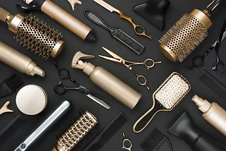
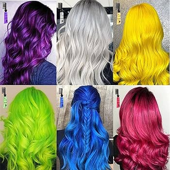
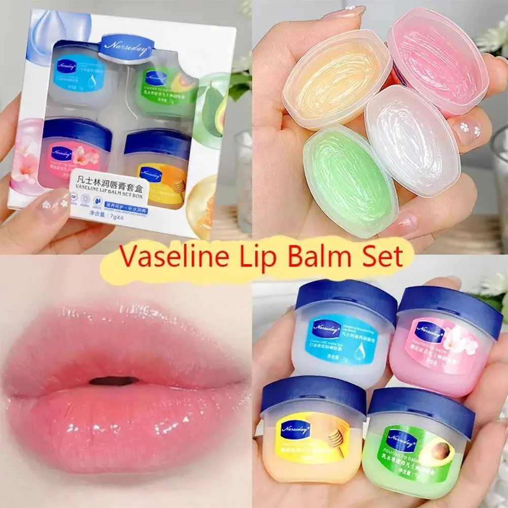
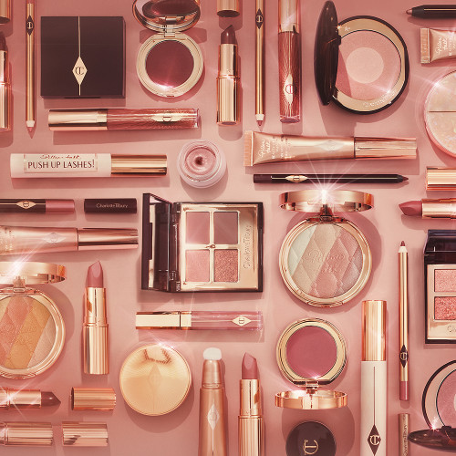
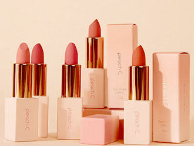
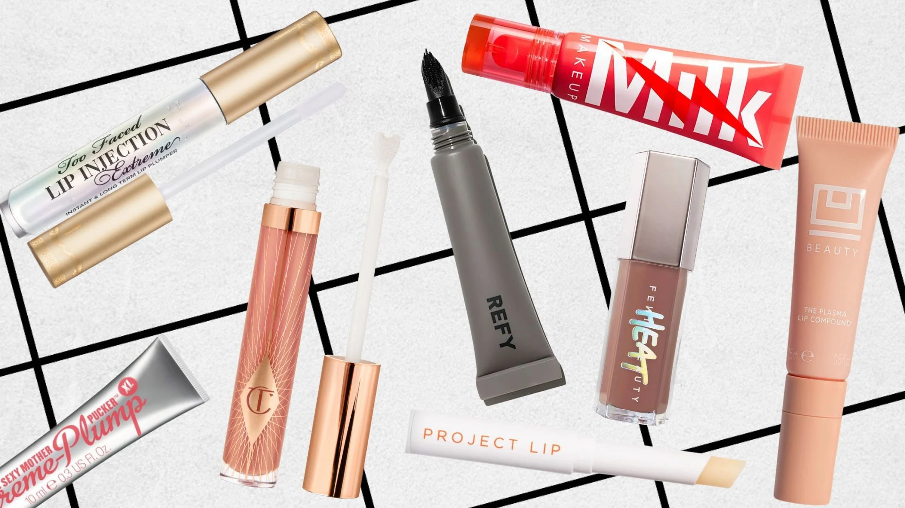
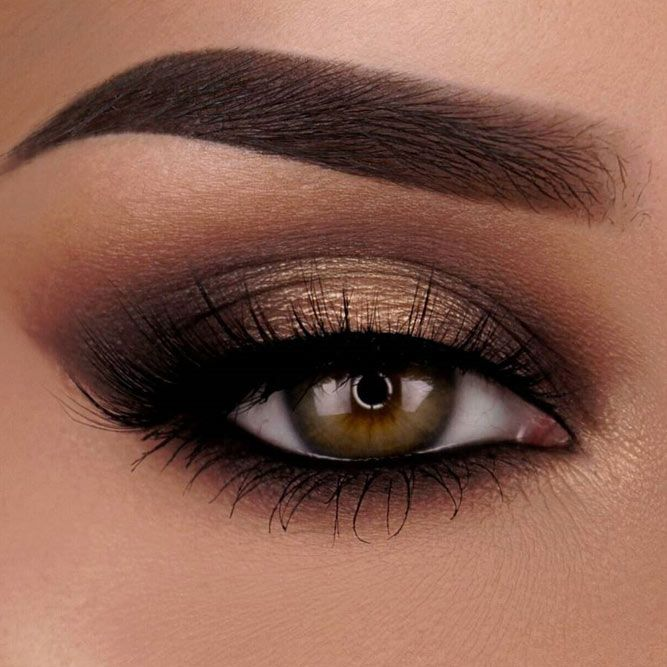
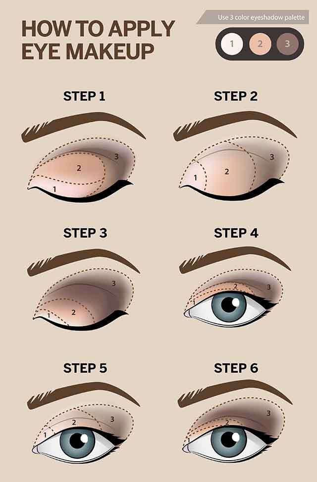
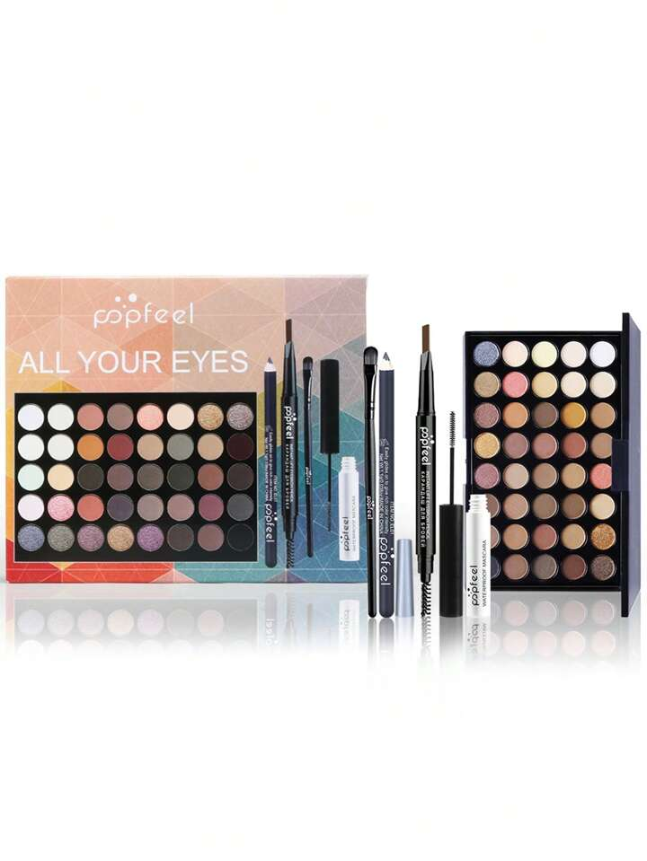

```{r setup, include=FALSE}
knitr::opts_chunk$set(echo = FALSE)
```


Best Selling Hair Care...


The Ordinary Multi-Peptide Serum forHair Density.

amika Soulfood Nourishing Hair Mass. 

Kérastase Blond Absolute Anti-Brass Purple Shampoo.

OUAITexturizing Hair Spray. 

DrybarThe Brush Crush Heated Straightening Brush. 

Bumble and bumbleSurf Styling Leave In.


KérastaseElixir Ultime Hydrating Hair Oil Serum.


we have alot of items that you will enjoy such as:


-hair dye:

BENEFITS OF DYING UR HAIR...

Adds volume to ur hair.
Adding a subtle color to your hair can make it look thicker than it really is.
Makes your hair shiny.
People with dull, dry hair might want to give hair coloring a try.
Play up your features.
Enhance your haircut.


SOME QUOTES TO MOTIVATE U TO DYE UR HAIR...

Life is too short to have boring hair.
My hair color is as magical as my personality.
Messy buns and colorful hair are my kind of vibe.
Colorful hair, don't care.
Hair like cotton candy, sweet and delightful.
Feeling cute, might dye my hair later.

WHAT TYPE OF HAIR DO U HAVE?

curly,
ringleted,
straight
wavy,
wild,
lank,
blunt,
tame, 
bushy, 
frizzy, 
silky, 
long,
short,
flowing,
buzzed, 
cropped,
chopped, 
coifed,
styled,
gelled, 
loose,
flat,
shiny, 
dull,
bouncy,
thin,
thick,
wiry, 
dyed,
streaked,
layered

BELIEVE IT OR NOT OUR HAIR DYE
SUITS EVERY TYPE OF HAIR


lip care:

our lips need a little extra 
care sometimes especially in the colder seasons
time for smooth and shiny lip

ITEMS WE SELL FOR UR LIPS..

Then I Met You Honey Dew Lip Mask 15ml.

NUXE Rêve de Miel Lip Balm New Formula.

Summer Fridays Lip Butter Balm 15g (Various Shades) 

Kinship Supermelt Hyaluronic Plumping Lip Treatment 10ml.

Caudalie Vinotherapist Vegan Repairing Lip Balm 7.5ml. 

LANEIGE Lip Sleeping Mask - Berry (Original) 20g.


makeup:

WHAT IS THR POWER OF MAKEUP?

It's a way to express yourself, transform your outlook, shield yourself from insecurities, and ultimately boost your self-esteem. So, the next time you pick up your makeup brush, remember that you're not just applying makeup; you're harnessing the power to boost your self-esteem and face the world with confidence

QUOTES I LOVE;

makeup is not a tool meant to make an ugly thing beautiful it is meant to magnify the beauty
that already exists

money cant buy happiness...but it can buy makeup

i believe all women are pretty without makeup but witth the right makeup they are powerful

Cosmetics are care substances used to enhance the appearance or odor of the human body. They are generally mixtures of chemical compounds, some being derived from natural sources, many being synthetic.


lips:
{width=50%}
A face without a smile is like a sky without a sun. A smile is the best makeup that can change your looks and your heart. A smile is the light of personality. 




eyes;




Eye makeup is a type of cosmetics which aims to make the eyes look noticeable and attractive. It is mostly used by females, and by stage performers of all types. Eye makeup is an important part of the fashion and cosmetic industries. Subtle and effective eye makeup, chosen and blended with her skin and eye colour.

Just as highlighting is important, contouring your eyes is a must to fake a larger appearance. Use a dark brown shade, like L'Oréal Paris Infallible 24HR Eyeshadow in Bronzed Taupe, to define your eyes. Apply the shadow just slightly above the crease of your eye to create the illusion that your eyes are larger.

Waterline eyeliner, eyelash extensions, colored contacts, and false eyelashes all pose some risk to your eyes. These types of makeup are applied directly into or close to your eyes, potentially introducing unwanted bacteria. Contact injuries, especially scratching, can also be caused by makeup however our makeup is less dangerous and is actually very
good for ur eyes and lashes


